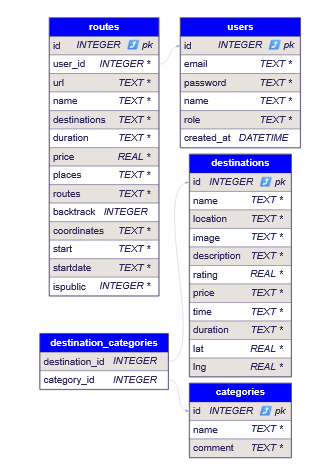

# Wanderlust

## General information about the project

### Project name  
**Wanderlust**

### Project description  
Wanderlust is a modern web-based travel planning service that allows users to create personalized itineraries, find interesting places, explore other users' public itineraries, and build their own routes on an interactive map.

The platform is designed for ordinary travelers and travel agencies, providing everyone with tools for convenient travel planning and organization.

### Main features  
1. **Authorization and Registration**  
   - Registration with role selection:  
     - `User` (regular user).  
     - `Agency` (travel agency).  

2. **Functionality for different roles**  
   - **User:**  
     - Creating, editing, deleting routes.  
     - View created routes.  
     - Search for interesting places to add to routes using the following criteria:  
       - Name.  
       - Category.  
       - Location.  
     - Search and filter public routes.  
     - Saving public routes to personal ones, making changes to them.  
     - Exploring interesting places.  
     - Building routes on an interactive map.  
   - **Agency (travel agency):**  
     - Create, edit, delete public routes.  
     - View created routes.  
     - Search for interesting places to add to routes by criteria:  
       - Name.  
       - Category.  
       - Location.  
   - **Admin (administrator):**  
     - The functionality has not yet been developed.  

### Project technologies  
- **Frontend:** React TypeScript, Vite, Tailwind CSS, Redux Toolkit.  
- **Backend:** Node.js (TypeScript), SQLite.  

### Third-party APIs  
- **OpenTripMap API:** For searching for interesting places such as tourist attractions, landmarks or places to relax.  
  Documentation: https://dev.opentripmap.org/product  
- **Google Maps API:** For accurate route planning and construction.  
  Documentation: https://rapidapi.com/gmapplatform/api/google-map-places/  

### Interactive map  
- `react-leaflet`: For integrating a map into a web application.  
- `Cargo`: For improved geodata processing and route visualization.  

### Purpose  
Wanderlust is designed for travelers who want to conveniently organize their trips, as well as for travel agencies who want to share their itineraries and offer ready-made solutions to their clients.

### Target audience  
- Individual travelers.  
- Travel agencies.  

### Uniqueness of the project  
Wanderlust combines the ability to create personalized itineraries, map integration, and advanced search features to create the perfect travel tool, whether for beginners or experienced travelers or agencies.

## Project settings

### General requirements  
To deploy the Wanderlust project, you need to configure environment variables on the frontend and backend, ensure correct integration with the API, and start the server and client side.

1. **Environment variables (.env file):**  
   Create a `.env` file in the backend root directory and add the following variables:  
   ```env
   JWT_SECRET=your_jwt_secret # Secret key for JWT generation
   PORT=8080 # Port to run the backend
   ```
   The secret key for JWT generation can be generated at https://jwtsecret.com/generate  

2. **Connecting environment variables:**  
    On the backend, environment variables are available through the `dotenv` library. For example:
    ```ts
    import dotenv from 'dotenv';
    dotenv.config();
    const jwtSecret = process.env.JWT_SECRET;
    ```

## Routes for authorization and authentication

### POST /auth/login  
Used for user login.  

### POST /auth/register  
Used to register a new user.  

### POST /auth/refresh  
Used to refresh the access token.  

## Routes for categories and points of interest

### GET /categories/  
Get a list of available categories.  

### GET /destinations/  
Getting a list of interesting places to explore.  

## Routes for working with routes

### POST /routes/create/  
Creating a new route.  

### DELETE /routes/delete/:id  
Deleting a route by its ID.  

### PUT /routes/edit/  
Editing an existing route.  

### GET /routes/get/  
Getting all user routes.  

### GET /routes/id/:id  
Getting information about a route by its ID.  

### GET /routes/public/:id  
Obtaining information about a public route by its ID.  

### GET /routes/public/  
Get a list of all public routes.  


## Commands to run the backend

### Installing dependencies
```bash
npm install
```
### Starting the server:
```bash
npm start
```
### The backend runs on port: http://localhost:8080

## Project structure

* **src**  
  Main directory for the backend, containing all core project modules.

  * **config**  
    Directory for project configuration.
    * **database.ts**  
      Module for connecting to the database (SQLite).
    * **jwt.ts**  
      Module for working with JWT (token generation settings, signature verification, etc.).
  
  * **controllers**  
    Directory for request handlers (route logic).
    * **auth.ts**  
      Controller for user authentication.
  
  * **data**  
    Directory for storing test or static data used in the project.
    * **admin.ts**  
      Static data for admin.
    * **categories.ts**  
      Data for categories.
    * **destinations.ts**  
      Data for interesting places.
  
  * **middleware**  
    Directory for middleware handlers.
    * **auth.ts**  
      Middleware for authentication token verification.
    * **validate.ts**  
      Middleware for validating request data.
  
  * **routes**  
    Directory for API routes.
    * **auth.ts**  
      Routes for authentication (/auth).
    * **categories.ts**  
      Routes for categories (/categories).
    * **destinations.ts**  
      Routes for interesting places (/destinations).
    * **routes.ts**  
      Routes for managing routes (/routes).
  
  * **index.ts**  
    Main file that gathers all routes.

* **.env**  
  Environment variables file.

* **data.db**  
  SQLite database file.

* **nodemon.json**  
  Configuration for automatic server restart during development.

* **package.json**  
  Node.js project configuration with dependencies.

* **tsconfig.json**  
  TypeScript configuration for the project.

## Database


